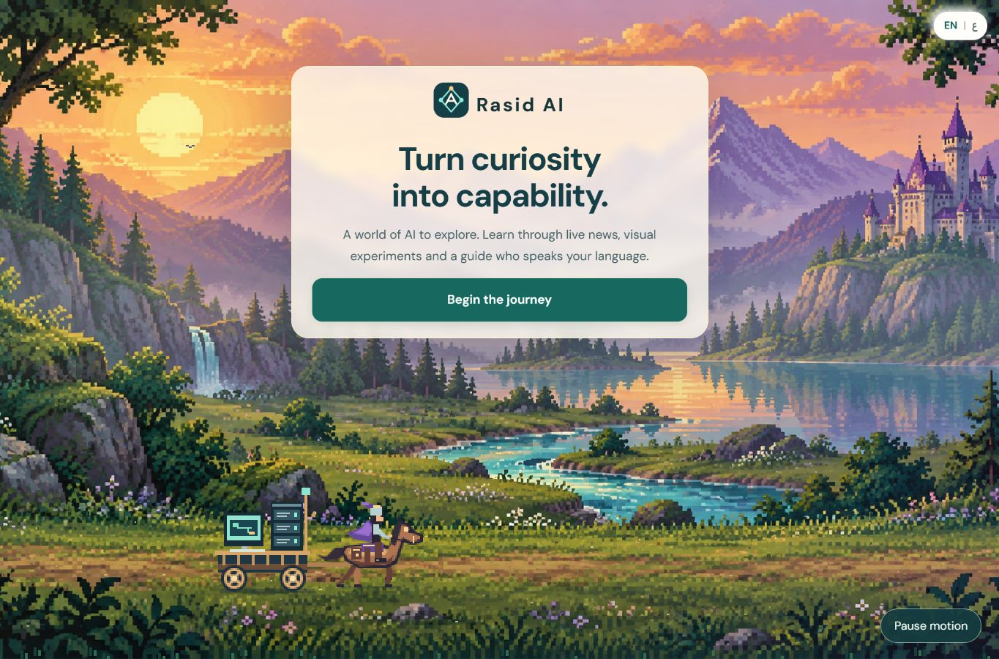
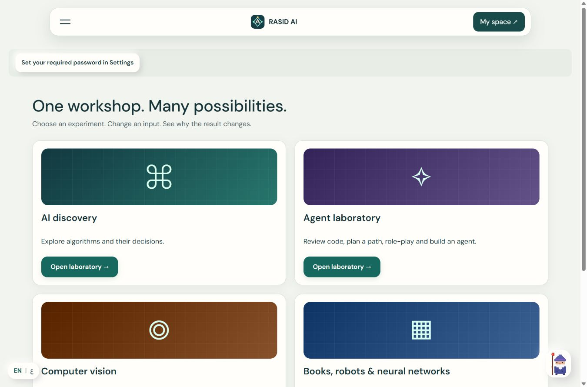
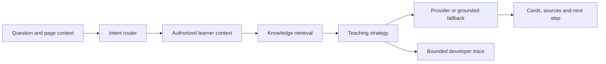

# Rasid AI · راصد

**Turn curiosity into capability.** A bilingual AI learning campus: learn, ask, practise, build, receive feedback and improve.

[Open the live platform](https://rasid-904v.onrender.com/) · [Agent architecture](docs/AGENT-ORCHESTRATION.md) · [Operations](docs/OPERATIONS.md) · [Screenshot gallery](docs/screenshots/README.md)



راصد منصة تعليمية بالعربية والإنجليزية تجمع الدروس والوكلاء التعليميين والتجارب التفاعلية وإدارة الحضور والتقدم. افتح **الإعدادات ← جولة إرشادية** لاستكشاف المنصة، أو امسح رمز التثبيت لإضافتها إلى شاشة هاتفك.

## Present the platform in five minutes

1. **Introduction:** animated pixel landscape, moving computer cart, language switch and motion controls.
2. **Settings → Take a guided tour:** automatic, role-aware walkthrough with pause, back, next and close. It opens pages without changing records.
3. **AI learning studio:** explain a concept, request practice, inspect feedback and choose the next learning step.
4. **AI Workshop:** scan a book, compare robot routes, train a network, or configure a learning agent.
5. **Administration:** demonstrate charts with **Test accounts only** selected. Fictional UAE-named examples are marked and do not represent real student activity.

Keep passwords, authenticator secrets and private learner records off presentation screens. The public installation QR is separate from the private authenticator QR.

## Features

| Area | Working features |
|---|---|
| Learning | Bilingual curriculum, placement, three levels, lesson progress, module quizzes, feedback, certificates and learning profile |
| AI assistant | Contextual routing, course retrieval, learner-aware guidance, structured response cards, English/Arabic speech and optional device generation |
| AI Workshop | BFS/DFS visualization, mixed exercises, agent laboratory, computer vision, book scanning, robotics and neural networks |
| Computer vision | Local-image grayscale/threshold/Sobel filters; synthetic office-entry decisions; editable policy code in a bounded no-network browser sandbox |
| Book vision | Camera/photo ISBN scanning; English/Arabic title OCR; editable extraction; free Open Library lookup |
| Robotics | Editable weighted maps, BFS/Dijkstra/A*, bounded robot commands, saved maps and reflections |
| Neural networks | Actual 2–4–1 XOR network, forward pass, gradients, training, predictions and loss chart |
| Campus | Role-filtered directory, classes, bookings, calendars, alerts, messages/read receipts, shifts, leave and subject coverage |
| Administration | Progress and attendance charts/tables, test-data filtering and cautious attendance trend recommendations |
| Account | Mandatory password, optional quick PIN, optional authenticator, device passkeys, privacy controls, guided tour and installation QR |
| Offline | Cached public lesson, local XOR training and optional device notebook after an online visit; public assets refresh on reconnect |



## AI agents: strengths and limits

These are specialized modes behind one contextual assistant, not ten independent frontier models. The default deployment works without a paid model key.

| Agent / mode | Strength | Current limitation |
|---|---|---|
| AI Tutor | Retrieves permitted passages; adapts explanations and examples to learner level and evidence | Free fallback is strongest on supported course topics; small device models have variable reasoning and Arabic quality |
| Practice Coach | Adaptive practice, concept diagnostics and explanations of mistakes | Short-answer rubrics are approximate; practice is separate from formal exam grading |
| Project Coach | Hints, milestones, attempts and saved project progress | Completion is self-reported; no arbitrary server execution |
| Code Reviewer | Static risk patterns, affected lines, Problem / Why / Fix / Example / Concept feedback | Not a compiler or comprehensive security audit |
| Learning Path | Recommendations using goals, weaknesses and study time | Rule-based roadmap, not a guarantee of learning outcomes |
| Socratic Tutor | Guided questions and prerequisite checks | Teaching mode within Tutor |
| Research | Approved current news sources with citations | Bounded retrieval; no unrestricted autonomous browsing |
| Progress Coach | Concept evidence, next steps and authorized administrative insights | Attendance extrapolations are uncertain scenarios, never decisions about people |
| Simulation | Guided CTO role-play and structured debrief | Bounded scenarios and pattern-based local feedback |
| Agent Builder | Save role/instructions and permitted course-search tools; test an agent | No unrestricted database, shell, browser or external API access |

### Request pipeline



Retrieval combines local bilingual TF-IDF/SVD semantic vectors with lexical, lesson, concept and level signals. This is a small statistical retrieval system, not a hosted frontier embedding service.

**AI Workshop → Developer debug view** is administrator-only. It shows question, intent, agent, chunks, mastery evidence, tool results and response. Three-level comparison uses isolated learner states. These are operational decisions, not hidden chain-of-thought. Detailed sanitized debug text expires after 24 hours; raw chat is not retained indefinitely by default.

Improve agents through bilingual evaluation sets, verified assessment rubrics, retrieval failure tests, latency budgets and human-reviewed feedback—not merely longer prompts. See [architecture and evaluation](docs/AGENT-ORCHESTRATION.md).

## Run locally

Requires **Node.js 22+** and npm.

```bash
npm ci
npm start
```

Open `http://localhost:3000`. Installation builds browser bundles and the site-guide PDF. Configuration is optional for basic local use. If copying `.env.example`, change `NODE_ENV=development`, `PUBLIC_ORIGIN=http://localhost:3000` and use a writable `RASID_DATA_DIR`. Never commit secret values.

```bash
npm test
npm run build-static
npm audit --omit=dev
```

New registrations are always students. Provision administrators with the documented server-side bootstrap; public signup requests cannot choose their role. `RASID_SEED_DEMO=1` adds fictional examples; use `RASID_SEED_DEMO=0` to disable seeding for a clean deployment.

## Password, PIN and MFA

- New accounts require **8–128 characters**, uppercase, lowercase, a number and a special character. Common patterns such as `Password1!` are rejected. Longer unique passwords are encouraged; paste and password managers remain supported.
- A **six-digit PIN is optional**, separately hashed, and can be added or removed in Settings. The password remains required and is used for security changes. Enabled login MFA also applies to PIN sign-in.
- Existing accounts keep access with their previous credential and receive a password-upgrade prompt. The owner chooses a new password; deployments do not invent or publish one.
- Saving credentials signs out other sessions. Resetting a password removes the quick PIN. Server credentials use salted scrypt hashes.
- Google Authenticator can be set up or skipped after signup. Device passkeys use local verification; Rasid does not receive raw face or fingerprint data.
- Email recovery/OTP, SMS OTP and CAPTCHA require configured services; the UI reports availability. A short PIN is less resistant to guessing than a strong password; login attempts are throttled.

These composition rules implement the requested product policy; they are not a compliance certification.

## Configuration and deployment

Render runs `npm start`. GitHub Pages cannot host the authenticated Node backend. Set secrets in **Render → Environment**. A missing local `.env` file is normal when Render supplies environment variables.

| Variable | Purpose |
|---|---|
| `PORT`, `NODE_ENV`, `PUBLIC_ORIGIN` | Port, production mode, canonical HTTPS origin for passkeys, same-origin checks and installation QR |
| `RASID_DATA_DIR` | Runtime data; use persistent storage for production |
| `SUPABASE_URL`, `SUPABASE_SERVICE_ROLE_KEY` | Private server-side persistence; first run `migrations/001-supabase-state.sql`; never expose service keys in frontend code |
| `RASID_OWNER_PIN_HASH` | Optional owner bootstrap hash; never commit its value |
| `RASID_SEED_DEMO`, `RASID_NO_UPDATE` | Example data and scheduled update controls |
| `RASID_AGENT_PROVIDER` | Default `local`; hosted generation requires explicit provider setup |
| `ANTHROPIC_API_KEY`, `RASID_MODEL`, `RASID_AGENT_MODEL` | Optional provider credential and model IDs; not required for grounded fallback |
| `NEWSAPI_KEY`, `NEWSAPI_PRODUCTION_ALLOWED` | Optional source; free Developer keys remain local-development-only; approved RSS feeds serve production |
| `SMTP_*` | Email recovery and OTP delivery |
| `TWILIO_*` | Optional SMS verification; service fees may apply |
| `TURNSTILE_SITE_KEY`, `TURNSTILE_SECRET_KEY` | CAPTCHA enabled when both keys are configured |
| `PRIVACY_OPERATOR`, `PRIVACY_CONTACT`, `HOSTING_REGION` | Actual operator information for the privacy notice |

Supabase stores a private application snapshot containing accounts and educational state. This is not a normalized multi-tenant schema. Without durable storage, an ephemeral host can lose data on redeployment. Use a single application writer for the snapshot design and follow [operations guidance](docs/OPERATIONS.md) for backups and scaling.

## Security boundaries

Server-side role/subject checks restrict private records. Private APIs are excluded from shared service-worker caches; writes have origin checks and throttling. Agent tools are allowlisted, structured output is validated, and learner code never executes on the production Node server. The teaching sandbox is a restricted browser environment.

User documents and external content are untrusted. Do not commit `.env`, runtime databases, API keys, authenticator secrets, private chat or screenshots of real learner records. Tests support, but do not replace, a professional deployment review.

## Install and offline use

**Settings → Install app** displays the public QR. Scan it on a phone, then use Android's browser menu or iPhone Safari → Share → Add to Home Screen. The browser controls prompt availability; the QR does not silently install software.

Visit `/offline.html` online once to cache public lessons and XOR training. Optional notes stay on that device and do not become graded progress automatically. Accounts, bookings, news and server-backed agents need a connection. Speech voices, microphone recognition and device AI depend on browser and hardware support.

## Repository map

| Path | Responsibility |
|---|---|
| `server/index.js`, `auth.js`, `security.js` | API, sessions, password/PIN, MFA, passkeys and origin checks |
| `server/agents/` | Router, context, retrieval, teaching, providers, memory and traces |
| `server/db.js`, `migrations/` | Persistent state and private storage |
| `server/campus.js`, `operations.js`, `portal.js` | Roles, classes, bookings, attendance, messaging and shifts |
| `data/curriculum/`, `data/knowledge/` | Bilingual curriculum, reviewed source notes, diagnostics and site guide |
| `public/js/`, `public/css/`, `public/art/` | Modular vanilla-JavaScript UI, assistant, labs, tour and responsive visual system |
| `public/sw.js`, `public/offline.html` | Public offline experience and cache lifecycle |
| `test/` | Auth, persistence, authorization, learning, retrieval, sandbox and algorithm regressions |
| `docs/screenshots/` | Actual browser captures with fictional records for product review |

## Verification and attribution

The September 2026 account/tour release passed **84 automated tests**, static build and desktop/mobile browser review. See [release checks](docs/ACCOUNT-TOUR-REVIEW.md) for scope. Optional provider delivery and real biometric/microphone hardware need device-specific acceptance checks.

Third-party dependencies retain their licenses. See [React Bits attribution](docs/REACT-BITS-LICENSE.md), [artwork notes](docs/ARTWORK.md) and cited knowledge-library sources. Reviewed excerpts retain citations; public availability does not transfer ownership of all source material.
